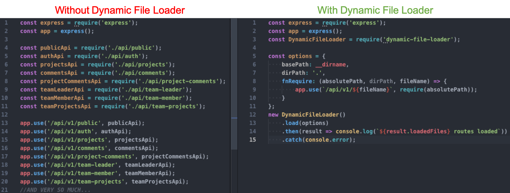

# **Dynamic File Loader (DFL)**
## Require or import files of directory dynamically and reduce your code.

[](https://travis-ci.org/carboleda/dynamic-file-loader)



# **Installation**
This is a Node.js module available through the npm registry.

Before installing, download and install Node.js. Node.js 0.10 or higher is required.

Installation is done using the npm install command:

```shell
$ npm install dynamic-file-loader
```

# **Features**
---
- Load all files in a directory dynamically
- Filter files to load using exclusion array or regular expression
- Use builder or option argument style
- Support promise or async/await

# **Examples**
---

#### Using promise to load all files on directory
```js
new DynamicFileLoader.Builder()
    .onDirectory(__dirname, '/files')
    .build()
    .load()
    .then(result => console.log(result.loadedFiles))
    .catch(error => console.error(error));
```

#### Using promise to load files with RegExp
```js
new DynamicFileLoader.Builder()
    .onDirectory(__dirname, '/files')
    .withFilter(/file([1-3]).js/)
    .build()
    .load()
    .then(result => console.log(result.loadedFiles))
    .catch(error => console.error(error));
```

#### Using async/await to load files with array exclusion and custom requirer function
```js
async function test() {
    try {
        let merged = {};
        async new DynamicFileLoader.Builder()
            .onDirectory(__dirname, '/files')
            .withFilter(['file1.js', 'file3.js'])
            .withRequirer((absolutePath, dirPath, fileName) => {
                merged = { ...merged, ...require(absolutePath) }
            })
            .build()
            .load();
            console.log(result.loadedFiles);
    } catch(error) {
        console.error(error);
    }
}
```

#### Using async/await and options argument
```js
async function test() {
    try {
        let merged = {};
        const options = {
            //absolute path directory where be files
            basePath: __dirname,
            dirPath: '/files',
            //list of files names to exclude or regular expression
            ommit: /file([4-6]).js/,
            //callback function to custom require (optional)
            fnRequire: filePath => merged = { ...merged, ...require(filePath) }
        };
        await new DynamicFileLoader().load(options);
        console.log(result.loadedFiles);
    } catch(error) {
        console.error(error);
    }
}
```